# Configuring virt-who with vSphere to Report Hypervisor Host Information to the Red Hat Customer Portal

## Introduction
If [Red Hat Satellite](https://www.redhat.com/en/technologies/management/smart-management) is not part of your Red Hat Enterprise Linux (RHEL) managment environment, you may still have the need to run virt-who to gather deployment information for RHEL VMs associated with your RHEL or Virtual Data Center (VDC) subscriptions when running in a virtualized environment.  

If you have Simple Content Access (SCA) enabled on your customer portal, you would not need to attach a subscription to a RHEL VM.  But with SCA enabled you as the consumer of Red Hat subscriptions will need to track your subscription usage to be compliant with your Red Hat agreement, and virt-who can assist with providing data to link RHEL VMs to specific hypervisors.

In this tutorial we will look at configuring virt-who to provide vSphere hypervisor host information when the RHEL VM is registered to the customer portal.  We can see the hypervisor and RHEL VM information in the customer portal and on the Red Hat Hybrid Cloud Console.

For this tutorial I created a small RHEL VM (1 vCPU with 2 GB RAM) to host the virt-who daemon.  This virt-who instance is gathering data from a 3 node EXSi cluster with local credentials.

## Installing, configuring and enabling virt-who
I registered the system with an activation key to Red Hat customer portal. Remember I have Simple Content Access enabled on my Red Hat customer portal, so I won't be attaching a subscription to this RHEL instance after I register it.

```
# subscription-manager register --org=xxxxxxxxx --activationkey=your_key_here
```

When using SCA, I am not attaching a subscription to my RHEL VM. When you run subscription-manager status, you will see that SCA is enabled and that you can attach any required content repositories to your RHEL VM.
```
# subscription-manager status
+-------------------------------------------+
   System Status Details
+-------------------------------------------+
Overall Status: Disabled
Content Access Mode is set to Simple Content Access. This host has access to content, regardless of subscription status.

System Purpose Status: Disabled
```
 
I checked to make sure that the RHEL 8 repos are enabled on the VM.  When creating the RHEL 8 VM from an ISO image on vSphere, the RHEL 8 repos are automatically enabled.
```
# subscription-manager repos --list-enabled
+----------------------------------------------------------+
    Available Repositories in /etc/yum.repos.d/redhat.repo
+----------------------------------------------------------+
Repo ID:   rhel-8-for-x86_64-appstream-rpms
Repo Name: Red Hat Enterprise Linux 8 for x86_64 - AppStream (RPMs)
Repo URL:  https://cdn.redhat.com/content/dist/rhel8/$releasever/x86_64/appstream/os
Enabled:   1

Repo ID:   rhel-8-for-x86_64-baseos-rpms
Repo Name: Red Hat Enterprise Linux 8 for x86_64 - BaseOS (RPMs)
Repo URL:  https://cdn.redhat.com/content/dist/rhel8/$releasever/x86_64/baseos/os
Enabled:   1
```

Check to see if virt-who is installed.
```
# rpm -qa virt-who
```

If virt-who is not installed, let's install it.
```
# yum -y install virt-who
...
Complete!
```

The virt-who installation creates a template configuration file that we can use to setup virt-who for our VMWare cluster.  The template configuration file is located under the /etc/virt-who.d/ directory.  


We will create the virt-who.conf file. Before editing the file we need the organization id under which the RHEL VM is registered. 
```
# subscription-manager identity
system identity: 2278e9a5-...-2b605607f2ba
name: virt-who.example.com
org name: #######
org ID: #######
```

The vCenter user ID needs read-only access to all objects in the vCenter.  See the troubleshooting section below if you need guidance in creating the user id. 

Now let's create and edit the virt-who.conf file in the /etc/virt-who.d/ directory. This configuration file is self-explanatory. The hypervisor_id setting is a default setting we need in the configuration file. 
```
# vi virt-who.conf
[vmware]
type=esx
server=vsca01.example.com
username=virt-who@vsphere.local
password=password
owner=#######
hypervisor_id=hostname
```

If you want to exclude exsi hosts from virt-who reporting for a particular VMWare cluster, add the filter hosts option to the virt-who.conf file.  Use commas to separate host names.  See the following example filter hosts line entry.
```
filter_hosts=esx02.example.com, esx04.example.com
```
If you have more than one vCenter, simply create as many sections in the configuration file to match the number of vCenter clusters.
```
[vcenter01]
type=esx
server=vsca01.example.com
username=virt-who@vsphere.local
password=password
owner=#######
hypervisor_id=hostname

[vcenter02]
type=esx
server=vsca02.example.com
username=virt-who@vsphere.local
password=password
owner=#######
hypervisor_id=hostname
```

Before starting virt-who you can manually test the configuration.
```
# virt-who --print
```

For an easier readout of the configuration test, try the following command.
```
# virt-who --print | jq
```

Let's start the virt-who daemon.
```
# systemctl start virt-who
```

Let's check the status of the virt-who daemon.
```
# systemctl status virt-who
```

Make virt-who startup automatically when the server is rebooted.
```
# systemctl enable virt-who
Created symlink /etc/systemd/system/multi-user.target.wants/virt-who.service → /usr/lib/systemd/system/virt-who.service.
```

Let's encrypt the password contained in the virt-who.conf file.

To do that run the virt-who-password command and supply the vCenter password.
```
# virt-who-password
Password: 
Use following as value for encrypted_password key in the configuration file:
14809...98a885d4cecd
```

Change your virt-who.conf file to the following.
```
# vi virt-who.conf
[vmware]
type=esx
server=vsca01.example.com
username=virt-who@vsphere.local
encrypted_password=14809...98a885d4cecd
owner=#######
hypervisor_id=hostname
```

You can test this new configuration using the same command above.  Remember to restart the virt-who daemon.
```
# systemctl restart virt-who
```
### Viewing the virt-who reporting in the Red Hat Customer Portal and the Red Hat Hybrid Cloud Console
Head over to the [Red Hat customer portal](https://access.redhat.com) and login.

After you login, in the Red Hat customer portal, click on the Subscriptions link in the upper left hand corner of the Red Hat customer portal landing page.
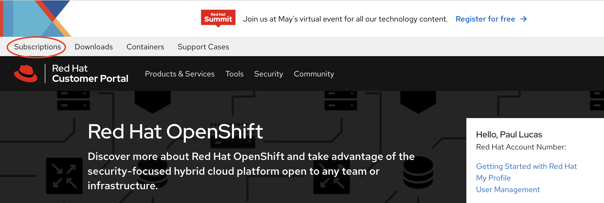
  
On the Subscriptions page, click the Systems tab.  On the Systems page you will see the hypervisors that virt-who is aware of via the virt-who.conf file.  
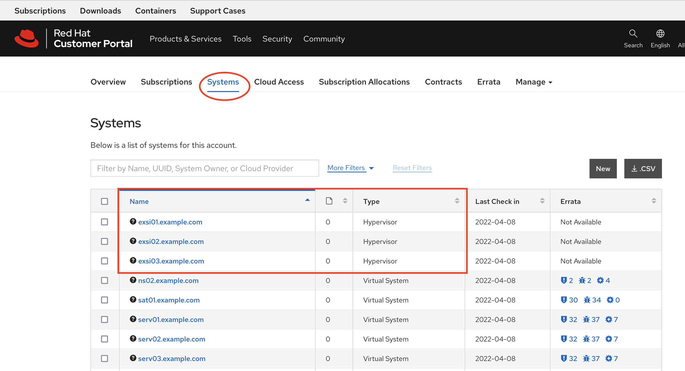
  
Click on a hypervisor link in the Systems page to get to the Details information for a particular hypervisor.
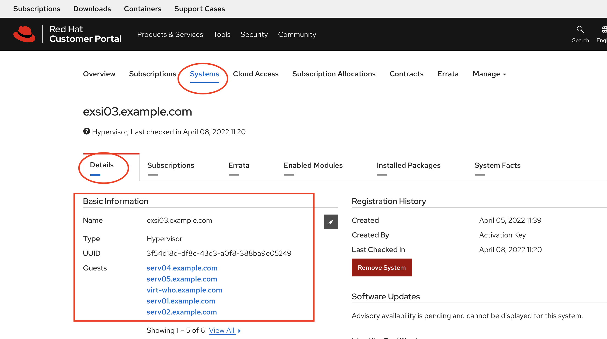

From the Systems page, if you choose a RHEL instance, you will also be able to see the hypervisor that the RHEL VM is running on in the RHEL VM's instance Detail page.

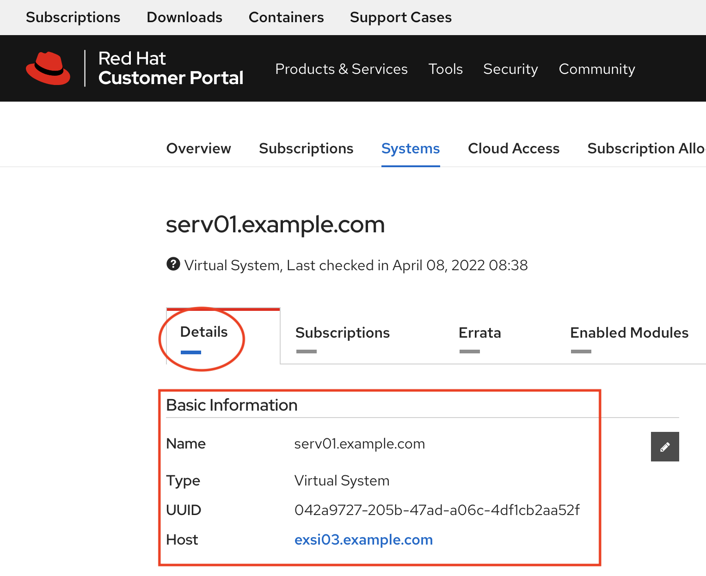

Now let's head over to the Red Hat Hybrid Cloud Console and login.
[Red Hat Hybrid Console](cloud.redhat.com/)

After you login to the Red Hat Hybrid Cloud Console, choose Red Hat Enterprise Linux from the side menu.
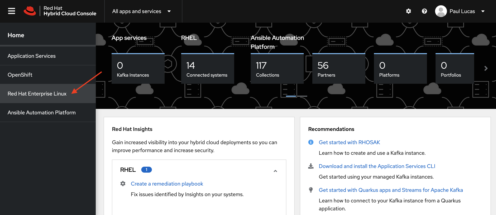

On the Red Hat Enterprise Linux page expand the Subscriptions option on the side menu and click the All RHEL link.  Scroll down on the subscription page to Insights registered RHEL servers and VMWare Hypervisors that are hosting RHEL VMs.
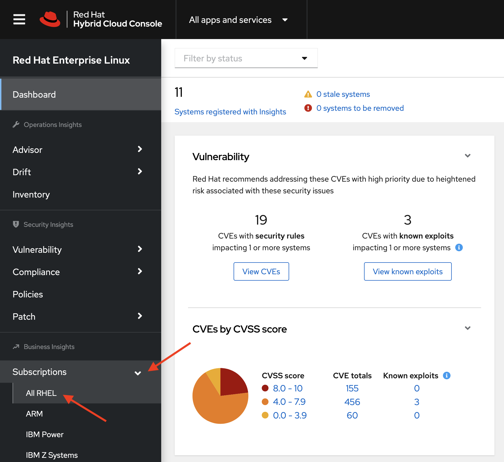

You can expand the VMWare Hypervisor link to see what guest machines are running on a particular hypervisor.  Also note that when the VMWare Hypervisor hostname first shows up in the All RHEL subscription section, it is listed as a UUID.  We will change the UUID to the hypervisor name in the next steps.
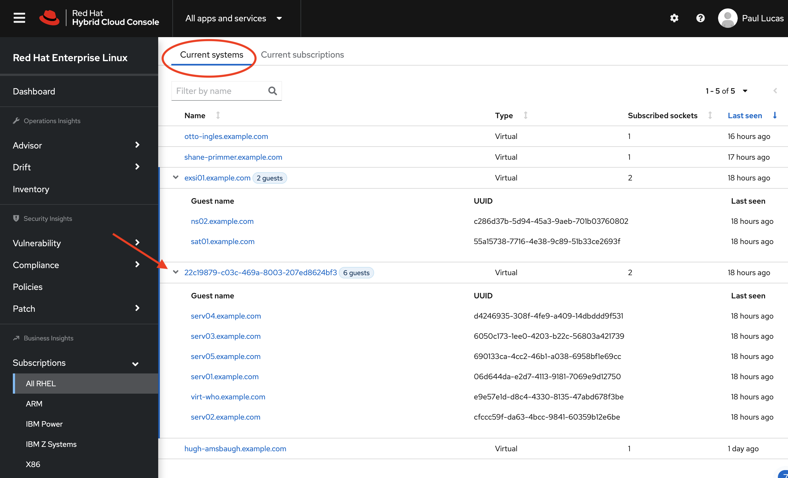

To update the hypervsior hostname from the UUID to something more meaningful, click on the hypervisor link in the All RHEL page.
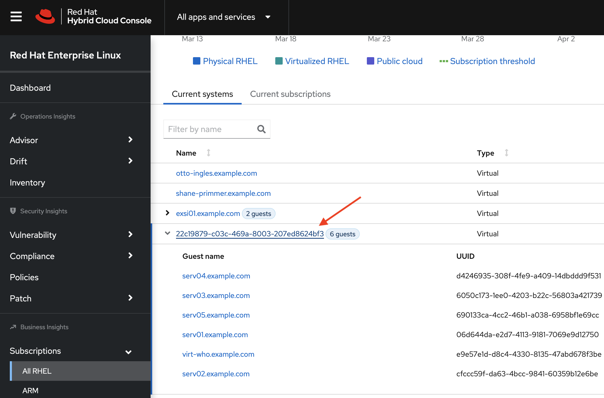

You will be taken to the Inventory page of the Hypervisor.  On the Inventory page, click the pencil icon next the Display Name to change the Display Name to the hypervior's hostname.
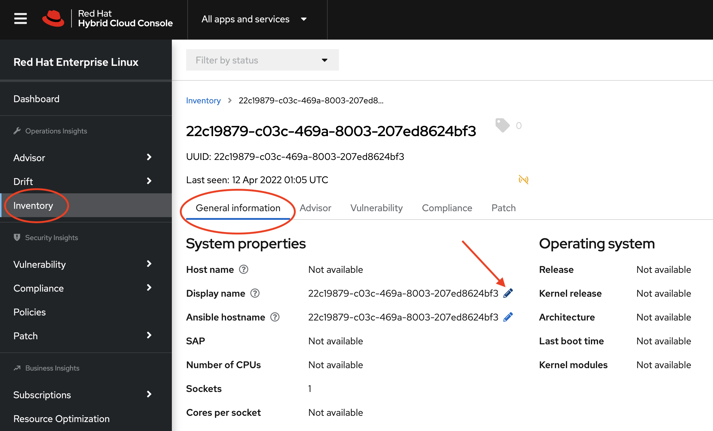

A dialog box will open where you can edit the Display name.  After changing the Display name click the blue Save button.  Repeat this step for the Ansible hostname.
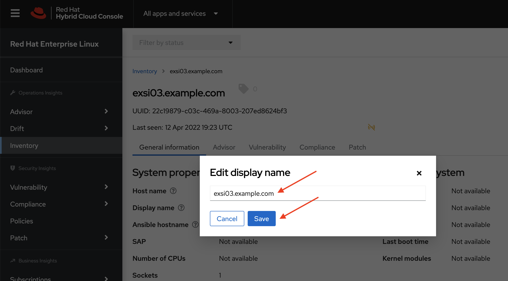

Back on the Inventory page, you will see the Display name has been updated.  The display name in the Subscriptions | All RHEL page will be updated after the next check in with the Red Hat Hybrid Cloud Console which typically happens in 24 hours.
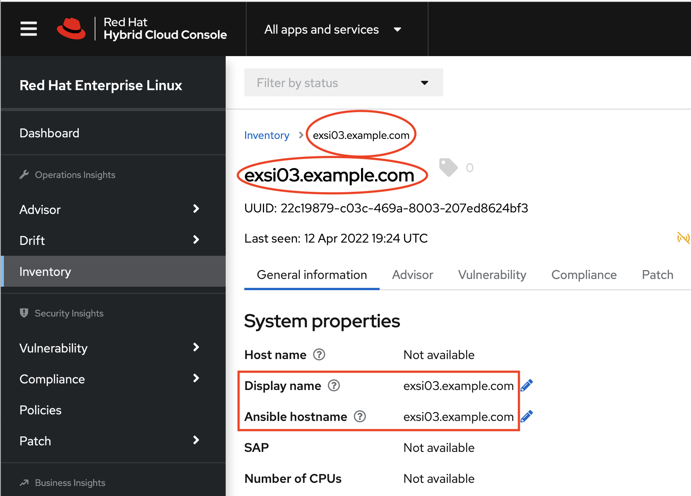


### Trouble hooting and additional notes
- In this tutorial my vSphere Client version is 6.7.0.47000. I created the virt-who user id under the Administration - Single Sign-on - User and Groups menu. The user id  "virt-who" is part of the vsphere.local domain.  Under the Administration - Access Control - Global Permissions menu, I create a Read-Only permission with virt-who as the user.  
- Test the virt-who VMWare user id and password with a vSphere client.
- Test virt-who VMWare user id with the password unencrypted in the virt-who conf file.  When the test is successful, encrypt the password and retest
- If you test the virt-who command with the print option (or with any other command line options), make sure you are "running" as root (sudo or su).

## Conclusion
In this tutorial we learned about virt-who and how we can use its reporting information to both understand RHEL subscription consumption and where our RHEL VMs are hosted.

## References
- [Configuring virt-who with Red Hat Subscription Management](https://www.youtube.com/watch?v=0KptauyDAxE) - YouTube Video
- [Why and when do I need Virt-Who?](https://access.redhat.com/articles/1300283)
- [How to configure virt-who for an ESX/ESXi host with RHSM?](https://access.redhat.com/solutions/3243861)
- [Using RHEL Virtual Data Center Subscription - Master Article](https://access.redhat.com/solutions/3243071)

